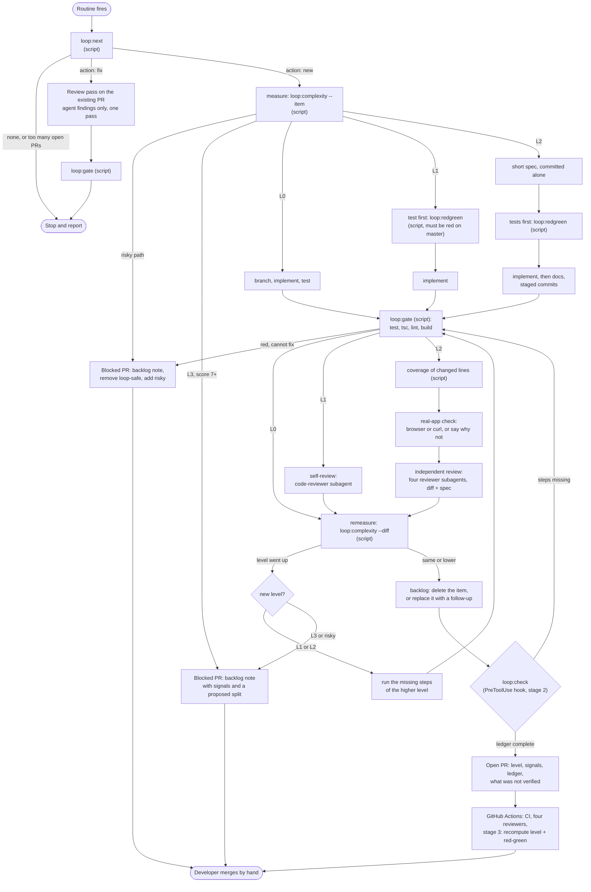

# The loop: code quality, complexity routing, and how to orchestrate it

Research note, 2026-10-09. Read-only investigation: no repo file other than this one was changed,
nothing was committed or pushed, no PR or comment was posted, and no database, Neon or Render tool
was used. Sources are the pull requests themselves (read with `gh`), files in this repo, the output
of commands run locally, and official tool documentation fetched on 2026-10-09, cited inline.
Where a statement is my own inference and not something a source says, it is marked
**(inference)**.

The developer's questions: what would raise the loop's code quality and testing and let it take
more complex work safely; how to measure a task's complexity before starting and run a matching
amount of process; and how to "put that in a graph", meaning a tool that orchestrates the routed
workflow as an explicit graph of steps. A shorter section covers whether the graphify knowledge
graph can supply the complexity signals.

## Short answer

1. **Orchestration: stay inside the routine, and move the graph out of the prose.** Keep the loop
   as a Claude Code routine. Put the workflow graph in a small pure TypeScript module in
   `scripts/loop/` (nodes, and the path each level takes), let `loop:next` print the level and the
   exact step list, and have scripts, not the agent, run the gate and write an evidence ledger.
   Then add two hooks in `.claude/settings.json` that refuse to open the PR, or to stop, until the
   ledger shows every required step for the level. This enforces order and mandatory steps with
   no new dependency, no new infrastructure and no change of billing. GitHub Actions is the right
   second stage, as an outside check on the PR, not as the thing that drives the agent. The Agent
   SDK, LangGraph and Temporal all work but cost more than a solo, once-a-day loop gets back.
2. **The loop's PRs are small and clean, and that is the limit of what the evidence shows.** Six
   real loop PRs: one source file each, 17 to 121 added lines, five reviewer findings in total,
   four of which needed the developer. There is no failed or oversized run to learn from.
3. **The loop does small work because the backlog only offers small work.** Six of the seven
   `[loop-safe]` items are single-file colour-token changes. Process is not what holds it back
   today; the tagging is. A complexity measure is what makes it safe to tag bigger items.
4. **The biggest quality gaps are in the routine, not in the agent.** `PROMPT.md` never asks for a
   tier; it has no step for the feature tier's spec, independent review or real-app check; it does
   not require proof that a new test fails without the change; it deletes the backlog item even
   when part of the work remains (the cause of both findings on #10); and one of the four gate
   commands checks nothing, so three PRs changed `server/` code with no type-check.
5. **Complexity rule:** risky paths stop the run before any score. Otherwise score = files +
   importers + layers + hub + untested + new-behaviour, giving L0/L1 (trivial/fix tier), L2
   (feature tier) or L3 (do not attempt, ask for a split). Measure twice: from the backlog item
   before starting, and from the real diff before opening the PR.
6. **The knowledge graph is not a good source for the measure today.** This repo's graph does not
   resolve imports written with the `@/` path alias, so almost every frontend component shows zero
   dependents. A 60-line import scan in TypeScript gives better numbers with no install. The code-only graph build takes
   5.6 seconds, so availability in the cloud is not the obstacle; accuracy is.

---

## 1. How the loop runs today (read from the repo)

- **Host.** "A scheduled cloud agent" (`docs/superpowers/specs/2026-10-04-solo-dev-workflow-design.md:286`),
  that is, a Claude Code routine: `CLAUDE.md:193` says the connection string "lives only in the
  routine's environment", and `BACKLOG.md:774` names the cloud environment `liberal-page-loop`.
  Routines "run autonomously as full Claude Code cloud sessions: there is no permission-mode
  picker" and they use skills committed to the cloned repository
  (https://code.claude.com/docs/en/routines). They draw on the account's subscription usage and
  act as the account owner on GitHub (same page), which is why every loop PR and every loop
  comment is authored by `DerLegatLabienus`.
- **Cadence.** The spec says weekly. The PRs say daily: #7, #8, #9 and #10 were opened on 6, 7, 8
  and 9 October, each between 06:12 and 06:25 UTC (`gh pr list --state all`).
- **Instructions.** `scripts/loop/PROMPT.md` (244 lines). The routine's own saved prompt, which
  presumably points at that file, is stored in claude.ai and could not be read from here.
- **Deterministic parts.** `npm run loop:next` (`package.json:29`, `scripts/loop/next-item.ts`)
  prints `{"action":"fix"…}`, `{"action":"new"…}` or `none`. Item choice is a pure function
  (`scripts/loop/select-item.ts:45`), and so is the review-pass decision
  (`scripts/loop/review-pass.ts:173`). Both are unit tested. Everything after "here is your item"
  is prose the agent follows.
- **Constraints the orchestrator must respect.** GraphQL is blocked in the cloud session, so only
  `gh api` and `git` work (`PROMPT.md:28`). The loop never pushes to `master` and never merges
  (`PROMPT.md:12`). Changes under `.github/` are risky tier (`CLAUDE.md`, tier table), so the loop
  cannot make them and the developer needs a spec and a plan to make them.
- **Only the prompt keeps the loop off `master` today (inference).** The routines page says: "To
  control which branches a run can push to, use branch protection rules or rulesets on GitHub …
  GitHub applies them to the GitHub access you connected, so a rule that access can bypass doesn't
  block a run's push" (https://code.claude.com/docs/en/routines). The loop acts as the repository
  owner. Whether `master` has a ruleset without an owner bypass was not checked; if it has none,
  `PROMPT.md:12` is the only barrier.
- **Review.** Four reviewers run as GitHub Actions jobs on every PR push
  (`.github/workflows/pr-review.yml`, `.github/workflows/claude-code-review.yml`), through
  `anthropics/claude-code-action@v1` with `CLAUDE_CODE_OAUTH_TOKEN`. Each job is
  `continue-on-error: true`.
- **What reaches a cloud session.** The repo's `CLAUDE.md`, `.claude/settings.json` hooks and
  permission rules, `.claude/skills/`, `.claude/agents/` and `.claude/commands/` are all
  available, because they are part of the clone. Plugins the repo enables are not
  (https://code.claude.com/docs/en/cloud-environments, "What carries over from your setup"). This
  one table decides most of section 6: hooks and subagents committed to the repo run inside the
  loop with no extra setup.

---

## 2. The pull requests

Commands: `gh pr list --state all --limit 100 --json …`, then for each of #4 to #10
`gh pr view <n> --json …,commits` and
`gh api --paginate repos/DerLegatLabienus/liberal-page/issues/<n>/comments`. No PR has inline
review comments or GitHub reviews; reviewers post issue comments only.

PRs #1, #2 and #3 are the developer's (branch names without an item ID, no `loop` label). #4 to
#10 are loop-shaped. Two of those need a caveat:

- **#4 was a supervised run.** Its body says so: "produced by following `scripts/loop/PROMPT.md` in
  an interactive session, not by the scheduled agent". Its one finding was fixed in the same
  session 14 minutes later.
- **#5 is a trial, not a task** (LibPage-900, closed unmerged). It tested the structured comment
  format. It is reported separately below and excluded from the totals.

Since the loop and the developer share one GitHub account, authorship cannot tell them apart. The
markers used here are the `### loop — review pass` comment heading, the `Loop-Review-Pass: true`
commit trailer, and the "Supervised run" line.

### Evidence table

"Rounds" is the number of distinct head commits the reviewers commented on. Findings are counted
once per distinct problem per reviewer. A = `Needs: agent`, D = `Needs: developer`.

| PR | Item and task | Diff (+/−), source files | Tests added | Findings | Rounds | Outcome |
|---|---|---|---|---|---|---|
| [#4](https://github.com/DerLegatLabienus/liberal-page/pull/4) | LibPage-009: primary token on one button | +17/−13, 1 (`AuthControl.tsx`) | 1 component test (class names) | architecture 1 (old format, no `Needs` line, so D by the picker's rule) | 2 | Merged after 22 min. Fix made in the supervised session |
| [#6](https://github.com/DerLegatLabienus/liberal-page/pull/6) | LibPage-020: reject unknown channel kind | +121/−18, 1 (`admin-letters.ts`) | 9 route tests, then 6 more in the review pass (915 to 921) | code 1 A (non-array `channels` gave 500) | 2 | Merged after about 40 h. **The only real loop review pass** (`d839c38`) |
| [#7](https://github.com/DerLegatLabienus/liberal-page/pull/7) | LibPage-021: tokens in the sign-in dialog | +50/−35, 1 (`AuthControl.tsx`) | 2 component tests | architecture 1 D (amber classes), raised only on the second run | 3 | Merged after about 41 h. Fix `b3540d5` has no trailer: made by hand, not by the loop |
| [#8](https://github.com/DerLegatLabienus/liberal-page/pull/8) | LibPage-023: named buckets out of daily analytics | +28/−19, 1 (repository) | 2 repository tests | none | 1 | Merged after 6 h |
| [#9](https://github.com/DerLegatLabienus/liberal-page/pull/9) | LibPage-024: rate-limit the beautify route (`feat`) | +49/−21, 1 (`admin-letters.ts`) + `CLAUDE.md` | 3 route assertions in an existing file | none | 1 | Open |
| [#10](https://github.com/DerLegatLabienus/liberal-page/pull/10) | LibPage-025: tokens in BillCard | +81/−31, 1 (`BillCard.tsx`) | 7 component tests, new file | code 1 D, architecture 1 D, both the same problem: backlog item deleted while two colours remain | 1 | Open, `needs-developer` |

Totals for the six real items: **5 findings. By reviewer: architecture 3, code 2, security 0,
domain 0. By owner: agent 1, developer 4.** Every PR changed exactly one source file plus one test
file plus `BACKLOG.md` (#9 also updated one row in `CLAUDE.md`).

**The trial, #5** (+28/−0, deliberately rough code): first full round, code-reviewer 3 (2 A, 1 D),
domain-reviewer 3 (3 A), architecture-reviewer 1 (D), security 0. The loop's review pass
(`423445a`) fixed the agent findings; the next round still had code-reviewer 2 (1 A, 1 D) and
architecture 1 (D). So one pass did not converge even on a 28-line change, which matches the
routine's "one pass per PR" rule being a cap on effort, not a guarantee.

### What the PRs show

1. **Narrow range.** Largest diff 121 lines, of which 100 are tests. No multi-file change, no new
   module, no cross-layer change, no blocked attempt (`docs/LibPage-NNN-blocked` has never been
   used). Nothing here tests how the loop behaves on a hard task.
2. **Findings follow the kind of task, not its size.** Three of five findings are design-system
   issues on colour-token PRs. The smallest PR (#4, 17 lines) had a finding; the largest (#6) had
   one of a different kind.
3. **Reviewers are not consistent between runs.** On #7 all four said "No findings" at `b4eee5e`.
   At `155c1e2`, a merge of `master` that did not touch the dialog, architecture-reviewer flagged
   the amber classes, which had been there the first time. A clean first round is weak evidence.
4. **Reviewers do not always post, or post late.** On #5 only two of four commented on `7407be0`.
   On #6, domain-reviewer posted at 20:41 on 5 October and the other three at 14:18 on 6 October,
   about 18 hours later. With `continue-on-error: true`, a reviewer that fails is silent, and the
   picker "does not wait for reviewers that have not re-run" (spec, lines 311-312).
5. **A review round costs a day.** The loop stops after opening the PR (`PROMPT.md:147`); findings
   are handled "by a later run". On #6 the finding was posted on 6 October and fixed on 7 October.
6. **Both #10 findings were caused by the routine.** `PROMPT.md:130` says to delete the item's
   backlog section, unconditionally. LibPage-025 itself says to list unresolved classes under
   "Needs a design decision". The agent did both, and two reviewers objected that the open
   decision is now tracked nowhere.
7. **Verification is uneven, and honestly reported.** #4 and #10 were checked in a browser (#10
   with a temporary page, not the real drawer). #7 states "No browser check … was run" although it
   changed a visible dialog. #6 and #9 state that no `curl` against a running server was done
   because the run had no database. All six say `npx tsc --noEmit` "checks nothing today".
8. **Red-green proof was volunteered, not required.** #4, #7, #8 and #10 say the new tests fail on
   the old code ("checked by stashing the fix"). #6 and #9 do not say. The routine does not ask.
9. **The tier rules were not applied.** #9 is titled `feat(…)`, which is the feature tier in
   `CLAUDE.md` (one spec, independent review, real-app check). It has no spec and no independent
   review before the PR, and no PR body names a tier.

---

## 3. What would raise quality and allow harder tasks, ranked

Ranked by expected payoff. Each point names what was observed. Points 1 to 7 are **observed in
this repo**; the last group is **general practice** and has no evidence from these PRs.

| # | Change | Observed where | Why it pays |
|---|---|---|---|
| 1 | **Feed the loop harder items, behind a measure.** | 6 of 7 `[loop-safe]` items are one-file token swaps (`BACKLOG.md:72-206`). | Nothing else on this list matters while the input is this narrow. The measure in section 4 is what makes wider tagging safe. |
| 2 | **Make the gate real for `server/`.** | Every PR body: `tsc --noEmit` checks nothing (LibPage-018). #6, #8, #9 changed `server/` with no type-check; `npm run build` covers `src/` only (`CLAUDE.md`, Commands). | A complex server change with a type error would pass the gate today. LibPage-018 is tagged `[risky]`, so only the developer can fix it. It is a precondition for any L2 server work. |
| 3 | **Put the tier and its steps into the routine.** | `PROMPT.md` has one path for every item. `CLAUDE.md` requires a stated tier, and a spec plus independent review for features. #9 skipped both. | Routing is the request. Without it, a bigger item gets the same process as a one-line fix. |
| 4 | **Review inside the run, before the PR.** | A round costs a day (#6). Reviewers vary between runs (#7) and sometimes do not post (#5, #6). | The four briefs in `.claude/agents/` are available to a cloud session as subagents. Running the relevant ones before opening the PR turns a next-day round into minutes, and a second sample offsets reviewer variance. |
| 5 | **Require red-green proof, run by a script.** | Volunteered in 4 of 6 PRs, absent in #6 and #9. `code-reviewer.md` looks for "a test that would still pass if the change were reverted" but cannot run anything (its tools are read-only plus `gh`). | It is the cheapest strong test-quality check, and it is mechanical: run the new tests against `origin/master`'s source and expect a failure. |
| 6 | **Fix the "partly done" rule.** | #10: both findings. `PROMPT.md:130` against LibPage-025's own text. | One line in the routine: if anything in the item remains, replace the item with a smaller follow-up item (new ID from the "Next free ID" line) instead of deleting it. |
| 7 | **Make the real-app check a named step with a fallback.** | #7 skipped it; #6 and #9 could not run it. Cloud sessions ship PostgreSQL 16 and Docker pre-installed (https://code.claude.com/docs/en/cloud-environments, "Installed tools"), and `ALLOW_DEV_LOGIN` gives an admin session without Google (`CLAUDE.md`). | The stated blocker ("no database, no admin session") is solvable inside the session. Not tested here; see open questions. |

General practice, not observed here:

- **Staged commits for larger changes** (test first, then implementation, then docs), so a
  reviewer can read each step. Every loop PR so far is one commit, which is right at this size.
- **Changed-line coverage.** `npm run test:coverage` exists (`package.json:21`) and no PR used it.
  For L2 it gives a number where today there is a sentence.
- **Behaviour assertions over class-name assertions.** The token PRs assert that class strings are
  absent. Such tests pin the implementation; they pass or fail with the markup, not with what the
  user sees. No reviewer flagged this, so it is my judgement, not a finding.
- **A stop rule on scope growth.** If the diff grows past what was measured, stop and re-route.
  This is the second measurement in section 4.

---

## 4. Measuring complexity and routing by it

### Signals

All are computable by a script from the checkout, with no model call and no network.

| Signal | How it is computed | Buckets (points) |
|---|---|---|
| **Risky path** | Any touched path matches the risky list (below) | Hard stop, no score |
| **Files** | Source files touched, not counting `tests/`, `docs/`, `BACKLOG.md` | 1 = 0, 2-3 = 1, 4-7 = 2, 8+ = 3 |
| **Importers** | Distinct non-test files that import a touched file | 0-2 = 0, 3-9 = 1, 10-24 = 2, 25+ = 3 |
| **Layers** | Distinct areas among `src`, `server/routes`, `server/services`, `server/repositories`, `server/db`, `scripts` | 1 = 0, 2 = 1, 3+ = 2 |
| **Hub** | A touched file is in the ten most-imported files | +2 |
| **Untested** | A touched file is imported by no file under `tests/` | +1 |
| **New behaviour** | The item's conventional type is `feat` | +1, and the level is at least L2 |

Risky list, from real paths in this repo: `server/db/**` (schema and migrations), `.github/**`,
`render.yaml`, `scripts/seed-db.ts`, `scripts/seed-data/**`, `scripts/backfill-*`,
`scripts/loop-read-views.sql`, `server/middleware/auth.ts`, `server/routes/auth.ts`,
`server/services/auth-service.ts`, `server/services/auth-providers/**`,
`server/repositories/auth-repository.ts`, `src/contexts/AuthContext.tsx`.
`src/components/layout/AuthControl.tsx` is deliberately **not** on it: #4 and #7 restyled it
safely, and the backlog draws the same line (LibPage-030 excludes `AuthContext.tsx` as "auth area,
not for the loop").

### Rule

```
if any risky path        -> STOP (risky tier): follow "Blocked"
score = files + importers + layers + hub + untested + new_behaviour
score 0-1                -> L0
score 2-3                -> L1
score 4-6                -> L2      (also the minimum for a feat)
score 7+                 -> L3: do not attempt
```

**Measured twice.** Before starting, from the paths named in the backlog item (every loop-safe
item names its file in backticks; an optional `**Touches:**` line can list more). Before opening
the PR, from `git diff --name-only origin/master...HEAD`. If the second level is higher than the
first, the run does the higher level's steps, or stops if it reached L3 or a risky path. The second
measurement is the one that cannot be wrong about what was touched.

### Mapping onto the existing tiers

This adds no tier. It splits the existing "trivial / fix" row in two and gives the loop a way to
decline.

| Level | Existing tier (`CLAUDE.md`) | Paperwork | Before the PR |
|---|---|---|---|
| L0 | Trivial / fix | None | Gate |
| L1 | Trivial / fix | None | Failing test first, gate, self-review |
| L2 | Feature | One spec, no plan file | As L1, plus test plan, staged commits, in-run independent review, real-app check |
| L3 | (none: too large for unattended work) | Backlog note proposing a split | No code PR |
| STOP | Risky | Developer's spec and plan | No code PR; existing **Blocked** path |

### Workflow per level

**L0.** Branch. Implement. Add or update a test. Gate. Re-measure. Update the backlog. Open the PR
with the level and signals in the body.

**L1.** As L0, with three additions. Write the test first and record that it fails on
`origin/master`'s source. After the gate, run one in-session reviewer (the `code-reviewer` brief as
a subagent) on the diff, and fix what it marks `agent`. Record the red-green result and the
self-review verdict in the PR body.

**L2.** (1) Write a short spec at `docs/superpowers/specs/YYYY-MM-DD-<slug>-design.md`: goal,
out of scope, acceptance criteria, test plan with one named test per criterion. Commit it alone.
(2) Commit the failing tests. (3) Commit the implementation. (4) Commit docs. (5) Gate, plus
changed-line coverage. (6) Real-app check: browser for a visible flow, `curl` for a route; if it
cannot run, say so, never "passed". (7) Independent review by all four reviewer briefs as
subagents, with the diff and the spec but not the session's reasoning; fix every `agent` finding,
list every `developer` finding in the PR. (8) Re-measure. (9) Open the PR labelled `loop` and,
if any developer finding remains, `needs-developer`.

**L3.** Write no code. Open the docs-only PR the **Blocked** section already describes, with the
signals and a proposed split into items that each measure L2 or lower, and remove `[loop-safe]`.

**STOP.** The existing **Blocked** path, with `[risky]` added.

### The rule run against the past PRs

Computed on `master` at `8211131` with a throwaway import scan (regex over `import`/`from`/
`vi.mock`, resolving `@/` and relative paths; not added to the repo).

| Case | Files | Importers | Layers | Hub | Untested | feat | Score | Level |
|---|---|---|---|---|---|---|---|---|
| #4 LibPage-009 | 1 | 1 | 1 | no | no | no | 0 | L0 |
| #6 LibPage-020 | 1 | 1 | 1 | no | no | no | 0 | L0 |
| #7 LibPage-021 | 1 | 1 | 1 | no | no | no | 0 | L0 |
| #8 LibPage-023 | 1 | 3 | 1 | no | no | no | 1 | L0 |
| #9 LibPage-024 | 1 | 1 | 1 | no | no | yes | 1 | L2 by the feat floor |
| #10 LibPage-025 | 1 | 1 | 1 | no | yes | no | 1 | L0 |
| LibPage-026 to 029 (queued) | 1 | 1-2 | 1 | no | no | no | 0 | L0 |
| LibPage-030 ToastContext + its 9 importers | 10 | 3 | 1 | no | yes | no | 5 | L2 |
| Hypothetical: edit `src/types.ts` | 1 | 58 | 1 | yes | no | no | 5 | L2 |
| Hypothetical: poller + repository + route + hook, `feat` | 4 | 7 | 4 | no | yes | yes | 7 | L3 |
| Hypothetical: `server/db/schema/index.ts` | 1 | 31 | 1 | yes | no | no | n/a | STOP |

Three honest limits:

- **The thresholds are not calibrated.** Every real PR scores 0 or 1, so the sample cannot tell
  good cut-offs from bad ones. Treat the numbers as a starting point and revisit after ten or so
  routed runs.
- **LibPage-030 scores L2 for a mechanical move.** Ten files change, but nine are one-line import
  edits. File count overstates renames. That is an acceptable direction to be wrong in (more
  process, not less), but it is wrong.
- **The feat floor makes #9 an L2**, which means a spec for a 13-line rate limiter. That is what
  `CLAUDE.md` says today. Whether a well-written backlog item (LibPage-024 has "Do" and "Out of
  scope" sections) may count as the spec in the PR lane is the developer's call.

---

## 5. Orchestrating the workflow

The question is what should own the graph: measure, route, level steps, gate, review, PR. Five
options, judged against how the loop really runs (section 1).

### Option 1. Prompt-driven, with a deterministic script (baseline)

`npm run loop:next` grows a `level`, the signals, and the ordered step list for that level.
`PROMPT.md` shrinks to hard limits plus "do the steps you were given, in order".

- **Enforces:** the measurement and the choice of path, since a script makes them. Nothing about
  whether the steps were done.
- **Costs:** none. Same pattern as `select-item.ts`: pure function, unit tested, no dependency.
- **Fit:** exact. It is how the loop already picks its item. The no-push-to-`master` rule stays a
  sentence in the prompt.
- **Observability:** the routine's run log, plus whatever the PR body says.
- **Weakness:** steps are still claims. #7's skipped browser check is the kind of thing it would
  not stop.

### Option 2. Claude Code's own mechanisms

Four pieces, usable separately.

- **Hooks as gates.** A `PreToolUse` hook that exits 2 "blocks the tool call", and a `Stop` hook
  that exits 2 "prevents Claude from stopping, continues the conversation"
  (https://code.claude.com/docs/en/hooks, "Exit code 2 behavior per event"). So a hook on `Bash`
  can refuse the `gh api …/pulls` call until a ledger file shows the level's steps, and a `Stop`
  hook can refuse to end a run that has a branch but no PR and no blocked note. Stop hooks are
  bounded: "after stop hooks have continued the turn eight times in a row, Claude Code overrides
  the next block and ends the turn", and the input carries `stop_hook_active` (same page). Hooks in
  the repo's `.claude/settings.json` run in a single-repository cloud session
  (https://code.claude.com/docs/en/cloud-environments). They also run in the developer's local
  sessions, so the hook script must exit 0 at once unless it is a loop run, for example unless an
  environment variable set only in the `liberal-page-loop` environment is present.
- **Subagents as the independent reviewer.** "Each subagent runs in its own context window with a
  custom system prompt, specific tool access, and independent permissions"
  (https://code.claude.com/docs/en/sub-agents). The four reviewer briefs already exist in
  `.claude/agents/` and reach the cloud session as part of the clone. Subagent requests count
  toward the same usage limits (same page).
- **Skills per level.** One skill per level keeps each level's steps out of context until needed.
  Routines use "skills committed to the cloned repository"
  (https://code.claude.com/docs/en/routines); that a skill's body loads only when used is from
  https://code.claude.com/docs/en/skills, which I did not re-read for this note. A convenience,
  not an enforcement.
- **Chained headless runs.** A script calls `claude -p` once per stage with a per-stage
  `--allowedTools`, reading results with `--output-format json` and `--json-schema`
  (https://code.claude.com/docs/en/headless). This gives true stage isolation and an ordering the
  model cannot skip. But it needs somewhere to run that is not the routine's own session: nothing
  in the routines or cloud-environment docs describes starting `claude -p` from inside a cloud
  session, so that is unverified. Outside the routine it means the developer's machine or a CI
  runner, which is option 4 by another name.

- **Enforces:** mandatory steps (the PR cannot be opened without evidence), an independent review
  before the PR, and a hard block on forbidden commands. The last one matters most for the
  never-push-to-`master` rule: a `PreToolUse` hook that refuses `git push` to `master` and any
  merge call turns that rule from a sentence into a check, inside the session, with no change to
  repository settings.
- **Costs:** a few small scripts and about twenty lines of settings. No dependency, no
  infrastructure, same subscription billing.
- **Fit:** good. Runs inside the existing routine. `.claude/settings.json` is not in the risky
  list, but a hook there affects every session, so it deserves the same care.
- **Observability:** the ledger file's content goes into the PR body; hook blocks show in the run
  transcript, which the routine's run page links to.
- **Weakness:** an agent with a shell can in principle write the ledger by hand. The answer is to
  have scripts write it (`loop:gate` runs the four commands itself and records exit codes and the
  commit) and to have CI re-check the parts that matter (stage 3 below).

### Option 3. Claude Agent SDK orchestrator in `scripts/loop/`

A TypeScript program owns the state machine and calls `query()` per node, with per-node
`allowedTools`, `disallowedTools`, `maxTurns`, `maxBudgetUsd`, `hooks`, `agents` and a JSON-schema
`outputFormat` (https://code.claude.com/docs/en/agent-sdk/typescript, Options table).

- **Enforces:** everything. Order, retries, budgets and stops are ordinary code.
- **Costs:** a new dependency (`@anthropic-ai/claude-agent-sdk`), a new place to run it, and
  different billing. The quickstart authenticates with `ANTHROPIC_API_KEY`
  (https://code.claude.com/docs/en/agent-sdk/quickstart), and the overview says Anthropic "does not
  allow third party developers to offer claude.ai login or rate limits for their products,
  including agents built on the Claude Agent SDK"
  (https://code.claude.com/docs/en/agent-sdk/overview). Whether a personal script may use the
  subscription token is not stated on those pages; I did not verify it. The spec records that an
  earlier review script "needed an API key that was never configured" and was deleted for that
  reason (spec, line 407, "Seam 2: removed").
- **Fit:** poor today. It replaces the routine as host, so it needs a scheduler, a checkout,
  GitHub credentials and the database secret somewhere new. It keeps the loop off `master` only
  if the program is written to (deny rules or a hook callback), and it holds whatever GitHub
  credential you give it.
- **Observability:** as good as the logging you write.

### Option 4. GitHub Actions as the orchestrator

Jobs are nodes. A first job computes the level and exposes it with `jobs.<id>.outputs`, written
via `$GITHUB_OUTPUT`; later jobs declare `needs` and read `needs.<job>.outputs.<name>`
(https://docs.github.com/en/actions/how-tos/write-workflows/choose-what-workflows-do/pass-job-outputs),
and run or skip with `jobs.<id>.if`
(https://docs.github.com/en/actions/how-tos/write-workflows/choose-when-workflows-run/control-jobs-with-conditions).
The model steps would use the existing `anthropics/claude-code-action@v1` with the OAuth token.

- **Enforces:** order and conditions, by the platform. A skipped job is visibly skipped. A matrix
  is not needed: the level selects one path, not several variants of one job.
- **Costs:** this is all `.github/` work, so risky tier: spec, plan and confirmation for every
  change to the graph. Each job starts on a fresh runner, so work in progress has to travel through
  a pushed branch or artifacts. The workflow needs `contents: write` to push a branch, which today
  no review job has (`contents: read`). And a PR created with the repository `GITHUB_TOKEN` starts
  `pull_request` workflows only "in an approval-required state"
  (https://docs.github.com/en/actions/how-tos/write-workflows/choose-when-workflows-run/trigger-a-workflow),
  so the four reviewers would wait for a click unless another token is used. For the
  never-push-to-`master` rule this option is the weakest by default: a job that can push a branch
  can push `master` unless a ruleset forbids it.
- **Fit:** workable, but it moves the loop out of the routine and loses what the cloud environment
  provides: the `LOOP_DATABASE_URL` setup, the pre-installed Postgres and Docker, and GraphQL-free
  helpers that were written for that environment.
- **Observability:** the best of the five. One page per run, one log per node.
- **Best use:** not as the driver. As an outside check on a loop PR (stage 3).

### Option 5. LangGraph, and durable-workflow engines

LangGraph JS models a workflow as a `StateGraph` with nodes and edges, including conditional edges
that "call a function to determine which node(s) to go to next"
(https://docs.langchain.com/oss/javascript/langgraph/graph-api). Checkpointers "persist a thread's
graph state as checkpoints" for "human-in-the-loop workflows, time travel, and fault tolerance"
(https://docs.langchain.com/oss/javascript/langgraph/persistence), and `interrupt()` pauses a node
until the graph is re-invoked with a `Command`
(https://docs.langchain.com/oss/javascript/langgraph/interrupts).

- **Enforces:** everything option 3 does, plus pause-and-resume for the developer.
- **Costs:** a framework dependency, a host process, a durable store for checkpoints (the cloud
  session's disk does not outlive the run), and model calls billed by API key. The nodes would
  still have to shell out to Claude Code to edit and test, so the framework would wrap the agent,
  not replace it **(inference)**. Like option 3, it keeps the loop off `master` only if you write
  that in.
- **Fit:** poor. Its strongest feature, interrupt and resume, is something this loop already has
  in a simpler form: a PR with a `needs-developer` label is the pause, and the next run's
  `loop:next` is the resume, with GitHub as the durable state.

**Temporal** and similar engines replay a recorded event history to rebuild workflow state and
require workflow code to be deterministic (https://docs.temporal.io/workflows). That buys
exactly-once, long-lived workflows across failures. It needs a Temporal service and workers.
For one short run a day whose state already lives in git and GitHub, it is overkill.

### Comparison

| | Enforces order | Enforces mandatory steps | Keeps the loop off `master` | Stops for the developer | New dependency or infra | Billing | Fits the routine | Debuggable |
|---|---|---|---|---|---|---|---|---|
| 1. Prompt + script | No | No | Prompt only | PR label (existing) | None | Subscription | Yes | Run log |
| 2. Hooks, subagents | Partly (gates) | Yes, at the PR and at stop | Hook blocks the push | PR label | None | Subscription | Yes | Ledger + run log |
| 3. Agent SDK | Yes | Yes | Only if coded | Custom | SDK + a host | API key, per the docs | No | What you build |
| 4. GitHub Actions | Yes | Yes | Needs a ruleset | Environments, labels | Risky-tier workflows | Subscription token | No (replaces it) | Best |
| 5. LangGraph / Temporal | Yes | Yes | Only if coded | `interrupt()` / signals | Framework + host + store | API key | No | Good, with their tooling |

Independently of the option, a GitHub ruleset on `master` with no bypass for the owner would block
a push from any of them. That is repository configuration, so it is the developer's decision, and
it would also stop the trunk lane's own direct pushes unless the two are told apart.

### Recommendation and staged adoption

**Options 1 and 2 together, then option 4 as an outside check. Not 3 or 5.**

**Stage 1: routing as data (trivial tier, no enforcement).**
Add the measure and the graph as pure modules, extend `loop:next`, add script-run steps that write
a ledger, and rewrite `PROMPT.md` as a dispatcher. Also fix the "partly done" rule (section 3,
point 6). Judge it on the next ten runs: did the PR body's ledger match what the level required?

**Stage 2: enforcement inside the session (add only if stage 1 runs skip steps).**
A `PreToolUse` hook on `Bash` that blocks the PR-opening call and any push to `master`, and a
`Stop` hook as a backstop, both calling one ledger check and both inert outside loop runs. Add the
in-run reviewer subagents for L1 and L2. The check must leave the escape route open: on a branch
ending `-blocked` it requires only `measure`, otherwise a red gate on an L1 or L2 item could
neither open its blocked-item PR nor stop.

**Stage 3: an outside check (risky tier; add only if the ledger is not trusted).**
One workflow job on loop PRs that recomputes the level from the diff, compares it with the level
the PR body declares, and re-runs the red-green check: put the PR's test files on `master`'s
source and expect a failure. This is the one thing the agent cannot fake. It needs a spec, a plan
and the developer's confirmation, like any `.github/` change.

### Sketch of the recommended option

File layout (nothing below was added to the repo):

```
scripts/loop/
  complexity.ts     pure: (touched files, import map, item type) -> { level, score, signals }
  imports.ts        builds the import map from the checkout (regex scan, resolves "@/" and "./")
  workflow.ts       pure: the graph as data; pathFor(level) -> ordered node ids
  ledger.ts         read/append .loop/run.json (needs a .gitignore entry): { node, ok, commit, detail }
  gate.ts           runs the four gate commands itself, appends the result      (npm run loop:gate)
  redgreen.ts       runs the named tests on origin/master's source, expects red (npm run loop:redgreen)
  check.ts          exit 0 if the ledger satisfies pathFor(level), else exit 2  (npm run loop:check)
  next-item.ts      existing; "new" now carries level, signals and steps
.claude/settings.json   stage 2: PreToolUse(Bash) and Stop hooks calling loop:check
.claude/agents/         existing reviewer briefs, reused in-session
tests/unit/loop/        tests for complexity.ts and workflow.ts, next to the existing loop tests
```

The graph as data:

```ts
// scripts/loop/workflow.ts
export type Level = 'L0' | 'L1' | 'L2' | 'L3' | 'STOP'
export type NodeId =
  | 'measure' | 'branch' | 'spec' | 'test-red' | 'implement' | 'docs' | 'gate'
  | 'coverage' | 'real-app' | 'self-review' | 'full-review' | 'remeasure'
  | 'backlog' | 'open-pr' | 'blocked-pr'

const PATHS: Record<Level, NodeId[]> = {
  L0:   ['measure', 'branch', 'implement', 'gate', 'remeasure', 'backlog', 'open-pr'],
  L1:   ['measure', 'branch', 'test-red', 'implement', 'gate', 'self-review',
         'remeasure', 'backlog', 'open-pr'],
  L2:   ['measure', 'branch', 'spec', 'test-red', 'implement', 'docs', 'gate', 'coverage',
         'real-app', 'full-review', 'remeasure', 'backlog', 'open-pr'],
  L3:   ['measure', 'blocked-pr'],
  STOP: ['measure', 'blocked-pr'],
}

// Nodes a script runs and records itself; the rest are recorded by the agent with a reason.
export const SCRIPTED: NodeId[] = ['measure', 'test-red', 'gate', 'coverage', 'remeasure']

export const pathFor = (level: Level): NodeId[] => PATHS[level]

/** Nodes of the level's path that the ledger does not show as done at the current commit. */
export function missing(level: Level, done: { node: NodeId; ok: boolean; commit: string }[],
                        head: string, upTo: NodeId): NodeId[] {
  // A blocked-item branch only ever needs the measurement, whatever level was planned.
  const path = upTo === 'blocked-pr' ? PATHS.STOP : pathFor(level)
  const at = path.indexOf(upTo)
  if (at < 0) return [upTo]                       // this level's path never reaches that node
  const need = path.slice(0, at)
  const stale: NodeId[] = ['gate', 'coverage', 'remeasure']   // must be for HEAD, not an older commit
  return need.filter((n) => !done.some((d) =>
    d.node === n && d.ok && (!stale.includes(n) || d.commit === head)))
}
```

The measure:

```ts
// scripts/loop/complexity.ts
export interface Signals {
  files: number; importers: number; layers: number
  hub: boolean; untested: boolean; feat: boolean; risky: string[]
}
const bucket = (v: number, cuts: number[]) => cuts.filter((c) => v >= c).length

export function measure(touched: string[], importsOf: Map<string, Set<string>>,
                        hubs: Set<string>, feat: boolean): { level: Level; score: number; signals: Signals } {
  const src = touched.filter((f) => /^(src|server|scripts)\//.test(f))
  const isTest = (f: string) => f.startsWith('tests/')
  const importers = new Set<string>()
  for (const f of src) for (const i of importsOf.get(f) ?? []) if (!isTest(i) && !src.includes(i)) importers.add(i)
  const signals: Signals = {
    files: src.length,
    importers: importers.size,
    layers: new Set(src.map(layerOf)).size,
    hub: src.some((f) => hubs.has(f)),
    untested: src.some((f) => ![...(importsOf.get(f) ?? [])].some(isTest)),
    feat,
    risky: touched.filter((f) => RISKY.test(f)),
  }
  const score = bucket(signals.files, [2, 4, 8]) + bucket(signals.importers, [3, 10, 25]) +
    bucket(signals.layers, [2, 3]) + (signals.hub ? 2 : 0) + (signals.untested ? 1 : 0) + (feat ? 1 : 0)
  let level: Level = signals.risky.length ? 'STOP' : score <= 1 ? 'L0' : score <= 3 ? 'L1' : score <= 6 ? 'L2' : 'L3'
  if (feat && (level === 'L0' || level === 'L1')) level = 'L2'
  return { level, score, signals }
}
```

Inputs and outputs, in the style of the existing helpers:

```
npm run -s loop:complexity -- --item LibPage-026     # paths in backticks in the item, plus **Touches:**
npm run -s loop:complexity -- --diff                 # git diff --name-only origin/master...HEAD
-> {"level":"L0","score":0,"signals":{"files":1,"importers":2,"layers":1,"hub":false,
    "untested":false,"feat":false,"risky":[]},"steps":["measure","branch","implement","gate",…]}
exit 0 = printed; 2 = no source path could be determined (treat as L3: ask)
```

How the level selects the path: `loop:next` prints `level` and `steps`; the agent does them in
order; scripted nodes append to `.loop/run.json` themselves; before the PR call,
`loop:check --up-to open-pr` (by hand in stage 1, from the hook in stage 2) lists what is missing.

### The orchestrated graph



---

## 6. Can the knowledge graph supply the complexity signals?

Short version: the signals exist in the graph's schema, but in this repo's graph they are wrong
for the frontend, so not today.

> **Update 2026-10-10.** The frontend gap described below is fixed. graphify 0.9.48 did not follow
> the root `tsconfig.json`'s `references` to `tsconfig.app.json`, where the `@/` alias is declared;
> 0.9.83 does. After upgrading and rebuilding, importer counts match grep (`AuthControl.tsx` 2,
> `BillCard.tsx` 1, `button.tsx` 14) and the graph has 8,456 links. The numbers in this section
> are the 0.9.48 measurements and are kept as the record of what was found; the conclusion "not
> today" no longer holds for that reason, though the scoring thresholds remain uncalibrated.

**What the graph holds.** `graphify-out/graph.json` (built at `b190ce3`, graphify 0.9.48): 4,025
nodes, 6,437 links, 423 communities, stored undirected (`"directed": false`). Nodes carry
`source_file`, `community`, `file_type` (1,933 `code`, 1,213 `document`); links carry `relation`
(`contains` 2,302, `references` 1,321, `imports` 1,067, `imports_from` 732, `calls` 358, …),
`confidence` (6,068 `EXTRACTED`) and `source_file`.

**Derivable in principle.** Blast radius (`graphify affected "X" --depth N`, or a reverse walk over
`imports`/`imports_from`/`calls`); god-node touch (`graphify god-nodes --json`); communities
crossed (the `community` attribute); and which tests cover a file, since an import written in a
`tests/` file is a link whose `source_file` starts with `tests/`.

**What it returned for the past PRs** (file-level dependents over import and call links, code
nodes only):

| PR | File | Graph: dependents (non-test / test) | Import scan: importers (non-test / test) |
|---|---|---|---|
| #6, #9 | `server/routes/admin-letters.ts` | 1 / 5 | 1 / 6 |
| #8 | `server/repositories/letter-analytics-repository.ts` | 3 / 3 | 3 / 3 |
| #4, #7 | `src/components/layout/AuthControl.tsx` | **0 / 0** | 1 / 1 |
| #10 | `src/components/parliament/BillCard.tsx` | **0 / 0** | 1 / 0 |
| reference | `src/components/ui/button.tsx` | **0 / 0** | 14 / 0 |
| reference | `src/types.ts` | 27 / 0 | 58 / 11 |

`graphify affected "AuthControl.tsx" --depth 1` prints "No affected nodes found", and
`graphify affected "BillCard.tsx"` prints "No unique node match". The cause is the `@/` path alias
(`tsconfig.app.json:27`): the graph resolves relative imports and drops aliased ones. Three
observations agree. Of the import links that cross files, 1,714 are written in `.ts` files and
only **9** in `.tsx` files, in a repo with 118 `.tsx` files. The 27 dependents the graph gives
`src/types.ts` are 24 `server/` files, 2 `scripts/` files and 1 `src/` file, and
`grep` finds 27 imports of it written `../…types` against 43 written `@/…types`. And its 11 test
importers, which use the alias, are all missing. A fresh code-only build with the same version
gives the same 9. Separately, the build warns that nine `.tsx` test files "had syntax errors and
may be partially extracted". `BillCard.tsx` is really imported by
`src/components/layout/ParliamentDrawer.tsx`. Whether a later release (PyPI has 0.9.83) resolves
aliases was not checked.

For the server side the graph agrees with the import scan and correctly lists the test files that
exercise `admin-letters.ts`. So the test-coverage idea works where the edges exist.

**Correlation with how the PRs went:** none can be claimed. Six PRs, all one file, zero or one
finding each. Blast radius was 0 to 6 and unrelated to findings, which tracked task type
(section 2). The sample has no variance to correlate with.

**Getting it into the cloud.** Not the hard part:

- `time graphify extract . --code-only --out <scratch>` on this repo: **5.6 s** wall clock on 12
  cores, 478 files, 1,973 nodes, 3,731 edges, 291 communities, no API key. The real
  `graphify-out/` was not touched.
- The package is `graphifyy` on PyPI (`pip index versions graphifyy` lists 0.9.83). `pypi.org` and
  `files.pythonhosted.org` are on the cloud allowlist, and Python with pip is pre-installed
  (https://code.claude.com/docs/en/cloud-environments). A setup script could install it, and the
  environment cache keeps what a setup script installs (same page). Not tried in a cloud session.
- So of the three options, **build at the start of the run** is the one to choose if the graph is
  ever used: seconds, no artifact plumbing, always matches the checkout. A CI artifact adds a
  risky-tier workflow and a download through the proxy for no gain; committing the graph stays a
  bad idea for the reasons already judged.

**Recommendation.** Use the import scan (`scripts/loop/imports.ts` in the sketch) as the source of
the importer, hub and untested signals. It needs nothing installed, it is correct for `.tsx`, and
it is the same shape as the loop's other helpers. Revisit graphify for this if a newer version
resolves `@/` imports; the `measure()` function would not change, only where its import map
comes from.

---

## Open questions and things not verified

- **The routine's saved prompt, schedule and environment settings** live in claude.ai and were not
  read. "Daily" is inferred from PR timestamps; "it points at `PROMPT.md`" is assumed.
- **Hooks inside a routine run.** The docs say repo hooks apply in single-repository cloud
  sessions. No hook was added or tested in a real loop run, and the behaviour of a `Stop` hook in a
  routine (where no human can respond) was not observed.
- **Running the app in the cloud session** for a real-app check (local Postgres, dev sign-in,
  headless browser) is supported by the docs' tool list but untested here. #10 shows headless
  Chromium worked for a Vite page.
- **`claude -p` from inside a cloud session**: not documented on the pages read, not tried.
- **Agent SDK with a subscription token** for a personal script: the pages read only show API-key
  authentication. Not verified either way.
- **GitHub Actions cost** for extra jobs on this public repository was not looked up.
- **Thresholds** in the scoring rule are uncalibrated (section 4).
- ~~Whether graphify 0.9.83 resolves `@/` alias imports.~~ Verified 2026-10-10: it does (see the
  update in section 6).
- **Whether `master` is protected by a ruleset** that the owner's access cannot bypass.
- **Reviewer variance** rests on one case (#7) and missing verdicts on two (#5, #6). The Actions
  logs of those runs were not read, so the cause (failure, timeout, re-run) is unknown.
- **PR #5's code was assumed to be deliberately rough** because it is titled a trial; nothing in
  the PR says so outright.
- **Counts of tests added** come from PR bodies and line counts, not from running the suites.
